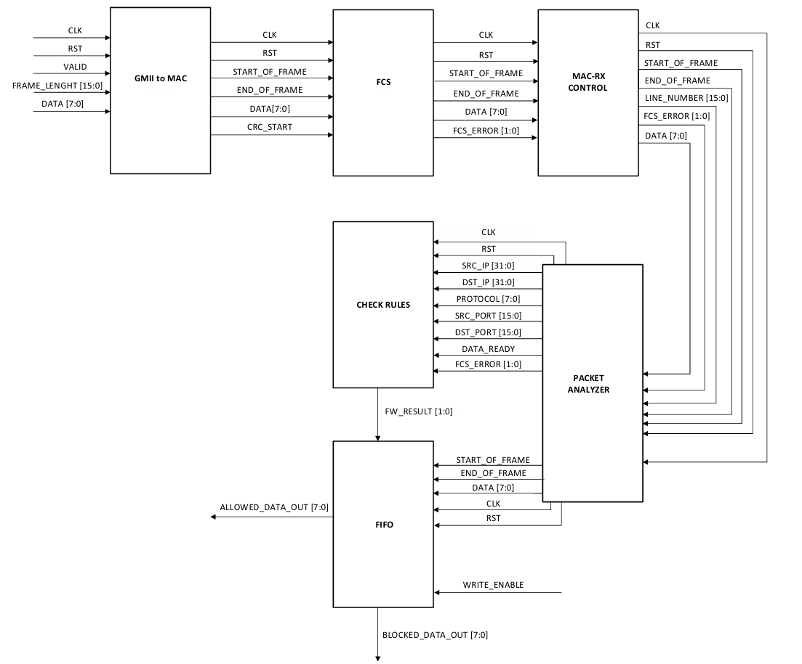

# VHDL Stateless Firewall for FPGA Implementation

**Project by:** Edoardo Santucci, Felix Hell, and Gea Staropoli.

This repository contains the VHDL source code for a stateless firewall designed for implementation on an Intel MAX 10 FPGA. The system inspects incoming Ethernet frames and makes decisions to either allow or block them based on a predefined set of static rules.

This project was developed for the "FPGA design for communication systems" (34349) course at the Technical University of Denmark (DTU).

---

### Key Features

* **Modular Architecture:** The design is broken down into distinct, interconnected VHDL modules, each responsible for a specific stage of packet processing.
* **Layer 3/4 Packet Filtering:** Filters packets based on the 5-tuple: Source IP, Destination IP, Protocol (TCP/UDP), Source Port, and Destination Port.
* **Frame Integrity Verification:** Implements a Frame Check Sequence (FCS) block using CRC-32 to validate packet integrity and discard corrupted frames.
* **Flexible Rule Matching:** The rule-checking logic supports wildcards, allowing for more general rules (e.g., "allow all TCP traffic").
* **Security-First Policy:** Implements a "default-deny" policy, blocking any packet that does not match an explicit "allow" rule.
* **Rigorous Simulation:** Each module and the final integrated system were thoroughly simulated and verified using ModelSim.

---

### System Architecture

The firewall processes Ethernet frames through a pipelined architecture, where each module handles a specific task before passing the data to the next stage.

1.  **GMII to MAC:** Receives the raw Ethernet frame from the physical interface and identifies the frame boundaries (start and end signals).
2.  **FCS (Frame Check Sequence):** Calculates the CRC-32 checksum to detect any corruption in the frame during transmission.
3.  **MAC-RX Control:** Assigns a sequential index (`line_number`) to each byte of the frame, which is crucial for identifying header fields in the next stage.
4.  **Packet Analyzer:** This is the primary parsing engine. It uses the `line_number` to extract the key fields from the Ethernet, IP, and Transport Layer headers (IPs, Ports, Protocol).
5.  **Check Rules:** This module contains the firewall's decision-making logic. It compares the extracted fields from the Packet Analyzer against a hardcoded rule table to decide whether to `ALLOW` or `BLOCK` the packet.
6.  **FIFO:** An asynchronous FIFO buffer that temporarily stores the entire packet while the `Check Rules` and `FCS` blocks complete their evaluation. Based on the final decision, it forwards the packet to an "allowed" or "blocked" data output.

---

### Technology Stack

* **Language:** VHDL
* **Simulation & Verification:** ModelSim - Intel FPGA Edition
* **Synthesis & Compilation:** Quartus Prime Lite Edition
* **Target Hardware:** Intel MAX 10 FPGA (10M50DAF484C7G)

---

### Getting Started

#### Prerequisites

* Intel Quartus Prime Lite Edition (v20.1.1 or similar)
* ModelSim - Intel FPGA Edition

#### Compilation

1.  Clone the repository.
2.  Open the project in Quartus Prime.
3.  Set `TopPackCheck.vhd` as the top-level entity for the full system compilation.
4.  Run the full compilation (Analysis & Synthesis, Fitter, etc.).

#### Simulation

Each module includes a dedicated testbench (`*_tb.vhd`). The entire system's functionality can be verified by running the **`tb_TopPackCheck.vhd`** testbench in ModelSim.

The final system was validated under three main scenarios:
1.  Packet is **blocked** by the default-deny policy.
2.  Packet is **allowed** by a matching rule.
3.  Packet is **blocked** due to an FCS integrity error, even if an "allow" rule matches.
